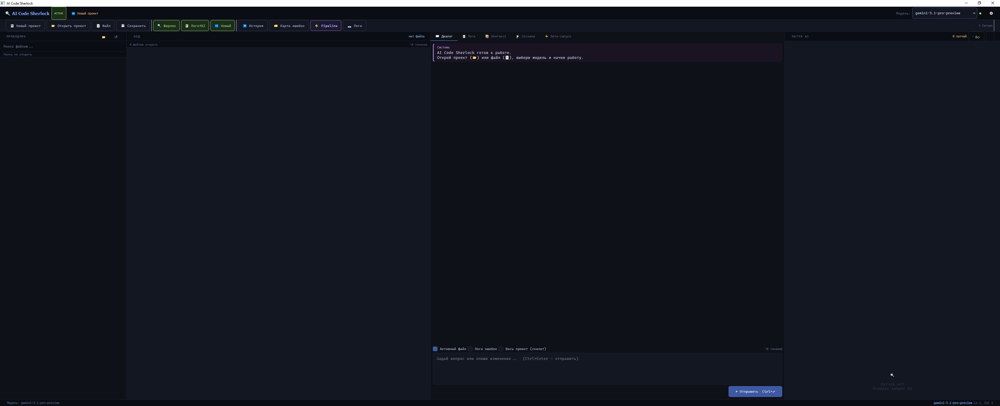

<div align="center">

# 🔍 AI Code Sherlock

**AI-powered IDE assistant for intelligent code analysis, surgical patching and autonomous improvement pipelines**

[](LICENSE)
[](https://python.org)
[](https://pypi.org/project/PyQt6/)
[](https://ollama.ai)

[🌐 Website](https://ai-code-sherlock-site.vercel.app) · [⬇ Download](https://github.com/signupss/ai-code-sherlock/releases/latest) · [📖 Docs](#-quick-start) · [🐛 Issues](https://github.com/signupss/ai-code-sherlock/issues)



</div>

---

## ✨ What is AI Code Sherlock?

AI Code Sherlock is a desktop IDE assistant that works like a detective for your codebase. It uses local (Ollama) or cloud AI models to analyze errors, generate surgical patches, and run autonomous improvement pipelines — without ever rewriting your whole file.

**Key idea:** instead of regenerating entire files, the AI outputs only `[SEARCH_BLOCK] → [REPLACE_BLOCK]` patches — precise, reviewable, and safe.

---

## 🚀 Features

- **⚙️ Auto-Improve Pipeline** — set a goal, run a script, let the AI iterate autonomously with 8 strategies (Conservative, Balanced, Aggressive, Explorer, Exploit, Safe Ratchet, Hypothesis, Ensemble)
- **🕵️ Sherlock Mode** — automated root-cause analysis with confidence scoring
- **⚡ Surgical Patching** — exact SEARCH/REPLACE, never rewrites whole files
- **🧠 Multi-Model Engine** — Ollama (offline), any OpenAI-compatible API, ZennoPoster File Signal
- **🗜️ Context Compression** — 120k tokens → 4k without losing signal
- **🗂️ Error Map** — persistent database of errors + confirmed solutions
- **📉 Log Compressor** — smart log compression preserving 100% of errors and tracebacks
- **⏱️ Version Control** — every patch backed up, one-click restore
- **🔄 Universal File Reader** — reads xlsx, parquet, numpy, pickle, HTML, JSON for AI context

---

## 📦 Quick Start

### Requirements

- Python **3.11+**
- Windows 10/11, macOS 12+, or Linux Ubuntu 20+

### Installation
```bash
# 1. Clone the repository
git clone https://github.com/signupss/ai-code-sherlock.git
cd ai-code-sherlock

# 2. Install dependencies
pip install PyQt6 aiohttp aiofiles

# 3. Run
python main.py
```

### Windows — double-click launcher
```
run.bat
```

---

## 🤖 Supported AI Models

### Ollama (offline, no API key needed)
```bash
ollama serve
ollama pull deepseek-coder-v2   # best for code
ollama pull llama3.2
ollama pull codestral
```

### Cloud APIs (OpenAI-compatible)

| Provider | Base URL | Model example |
|----------|----------|---------------|
| OpenAI | `https://api.openai.com` | `gpt-4o` |
| Anthropic | via proxy | `claude-3-5-sonnet` |
| Groq | `https://api.groq.com/openai` | `llama-3.3-70b-versatile` |
| Together AI | `https://api.together.xyz` | `mixtral-8x7b` |
| LM Studio | `http://localhost:1234` | any local model |

---

## ⚙️ Auto-Improve Pipeline

The most powerful feature — runs your script, reads output, generates a patch, validates syntax, applies it, and repeats autonomously.
```
Goal: "achieve f1 > 0.85 on validation set"
Script: train_model.py
Strategy: SAFE_RATCHET
Max iterations: 20
```

**8 AI Strategies:**

| Strategy | When to use |
|----------|-------------|
| 🛡️ Conservative | Only fix errors, minimal changes |
| ⚖️ Balanced | Fix + moderate improvements (default) |
| 🔥 Aggressive | Maximum changes, refactor logic |
| 🧭 Explorer | Different approach every iteration |
| 📈 Exploit | Double down on what already worked |
| 🔒 Safe Ratchet | Apply only if metrics improve |
| 🔬 Hypothesis | Form hypothesis → test → validate |
| 🎭 Ensemble | Generate 3 variants, pick best |

---

## ✂️ Patch Format

The AI generates structured SEARCH/REPLACE blocks:
```
[SEARCH_BLOCK]
    result = data[0]["value"]
[REPLACE_BLOCK]
    if not data:
        return None
    result = data[0]["value"]
[END_PATCH]
```

The engine finds the exact match (or normalized whitespace fallback), validates it's unambiguous, creates a backup, applies the patch, runs syntax check — all before saving.

---

## 🏗️ Architecture
```
ai_code_sherlock/
├── main.py                    # Entry point
├── core/
│   ├── models.py              # Domain models (dataclasses)
│   └── interfaces.py          # Abstract interfaces (ABC)
├── providers/
│   └── providers.py           # Ollama, CustomAPI, FileSignal
├── services/
│   ├── engine.py              # PatchEngine, PromptEngine, ContextCompressor
│   ├── auto_improve_engine.py # Autonomous pipeline orchestrator
│   ├── error_map.py           # Persistent error database
│   ├── log_compressor.py      # Smart log compression
│   ├── file_converter.py      # Universal file → AI text converter
│   ├── response_filter.py     # Unicode sanitizer
│   ├── version_control.py     # File backup and restore
│   ├── script_runner.py       # Async subprocess runner
│   ├── settings_manager.py    # Atomic JSON settings
│   └── signal_watcher.py      # ZennoPoster folder monitor
├── ui/
│   ├── main_window.py         # Main 3-panel window
│   ├── widgets/
│   │   ├── code_editor.py     # Editor with line numbers
│   │   ├── syntax_highlighter.py
│   │   └── file_tree.py       # Lazy-loading file explorer
│   └── dialogs/
│       ├── settings_dialog.py
│       └── patch_preview.py   # Before/after diff viewer
└── tests/
    └── test_all.py            # 55+ unit tests
```

---

## 🔍 Sherlock Mode

Enable the **🔍 Sherlock Mode** toggle to activate root-cause analysis:
```
Input:  error logs + relevant code
Output: hypothesis + minimal patch + confidence score
```

Example output:
```
Clue: data[0] accessed before empty-list guard at line 47
Root cause: function called with empty list on edge case
Confidence: HIGH (92%) — stack trace unambiguous
```

---

## ⌨️ Keyboard Shortcuts

| Shortcut | Action |
|----------|--------|
| `Ctrl+Enter` | Send to AI |
| `Ctrl+F` | Search in editor |
| `Ctrl+S` | Save file |
| `Ctrl+O` | Open file |
| `Ctrl+Shift+O` | Open project folder |

---

## 🧪 Tests
```bash
pip install pytest pytest-asyncio
python -m pytest tests/test_all.py -v
```

55+ tests covering: PatchEngine, ContextCompressor, PromptEngine, SettingsManager, FileSignalService, StructuredLogger, VersionControl.

---

## 📋 Settings Location
```
Windows:  C:\Users\<user>\.ai_code_sherlock\settings.json
Linux:    ~/.ai_code_sherlock/settings.json
macOS:    ~/.ai_code_sherlock/settings.json
```

---

## 📄 License

MIT License — see [LICENSE](LICENSE) for details.

---

<div align="center">
Built with ❤️ for developers who demand precision
</div>